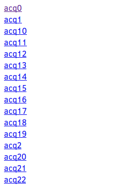
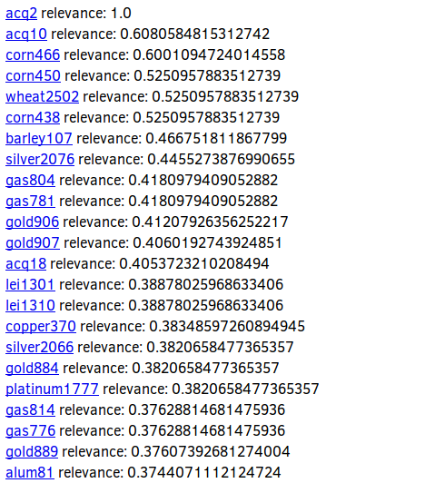

# Vector model search engine

# Documentation:

## Project description:

Our project should be able to process big amount of text documents and analyze their content.
Processing Program should be able to process data and create some kind of database - text file in our case.
This text file is inverted indexed of terms and documents.

Output of our program is again list of document names, sorted by relevance and similarity with respect to specific criteria.
This criteria is basicaly one of former documents being used as sort/search query.
Searching Program finds most relevant documents by cosine similarity, treating each document as vector of terms.

UI Program is supposed to let user interact with searching algorithm and display content of files for validation.

## Solution details:

For data processing we used porter stamming and filtering stop-words.
It's available as python library.
For term weights we used algorithm tf-idf. We implemented it ourselfs.
For searching we used cosine similarity, implemented by us again.

## Implementation:

We tried to be as much straight forward as possible. It was not that easy.
We used Python and JavaScript languages.
Python for implementing data analysis algorithms.
In this part of the project it took us large amount of time to write and lately refactor pretty much everything.
We didnt really care for runtime efficiency in pybros.py program, which is meant only to run once and process whole dataset.
Instead we focused on readability and clean code.
Because we used inverted index, we considered only those documents that contain terms as searched document. This allowed us to speed up search query.
In second part of project, presentation layer, we used all of our skills to present most efficient and simple UI possible. We admit strong inspiration in brutalism, which is rising trend among web developers.

## Output:

### Graphical UI

Input:


Output:



### Terminal UI

Input and Output:
``` bash
$ ./find_similar.py acq2

('./documents/acq2', 1.0)
('./documents/acq10', 0.6080584815312742)
('./documents/corn466', 0.6001094724014558)
('./documents/corn450', 0.5250957883512739)
('./documents/wheat2502', 0.5250957883512739)
('./documents/corn438', 0.5250957883512739)
('./documents/barley107', 0.466751811867799)
('./documents/silver2076', 0.4455273876990655)
('./documents/gas804', 0.4180979409052882)
('./documents/gas781', 0.4180979409052882)
('./documents/gold906', 0.41207926356252217)
('./documents/gold907', 0.4060192743924851)
('./documents/acq18', 0.4053723210208494)
('./documents/lei1301', 0.38878025968633406)
('./documents/lei1310', 0.38878025968633406)
('./documents/copper370', 0.38348597260894945)
('./documents/silver2066', 0.3820658477365357)
('./documents/gold884', 0.3820658477365357)
('./documents/platinum1777', 0.3820658477365357)
('./documents/gas814', 0.37628814681475936)
('./documents/gas776', 0.37628814681475936)
('./documents/gold889', 0.37607392681274004)
('./documents/alum81', 0.3744071112124724)
('./documents/dlr653', 0.3741679886491142)
('./documents/acq15', 0.3733502984324418)
('./documents/gold888', 0.3695898935918307)
('./documents/copper403', 0.36723721947401966)
('./documents/lead1288', 0.3664718003089546)
('./documents/lead1287', 0.3664718003089546)
('./documents/sugar2258', 0.3648816609262179)
('./documents/wpi2537', 0.36268087730962023)
```

## Experimental section:

We would like to present performance benchmarks for our project.
We impolemented both, linear and inverted indexed solution for storing our data, naturally, we expect our optimised solution to perform better in terms of runtime. There is single example of difference between naive and optimised solution:

``` bash
$ time ./find_similar.py coffee315 > /dev/null

real  0m0.913s
user  0m1.065s
sys 0m0.872s


$ time ./find_similar.py coffee315 > /dev/null

real  0m0.923s
user  0m1.036s
sys 0m0.915s


$ time ./find_similar.py coffee315 > /dev/null

real  0m0.921s
user  0m1.071s
sys 0m0.880s
```

This is optimised version of search.
Now take a look at naive solution:

``` bash

$ time ./find_similar.py coffee315 --linear > /dev/null

real  2m3.730s
user  2m2.488s
sys 0m2.269s
```
Naturally, we chosed nonlinear approach for our UI application.

Knowing structure and algorithm behind those algorithms, we explain this difference as absence of zero weight terms in inverted solution.
Since document is referenced only by those terms which dispose of non zero weight in said document, size of resulting database is not really related to the size of dataset, it can be pretty much almost any size regardless of the number of terms in single document or number of documents at all. 

## Discussion:



Our implementation is not really best in terms of precision. Actually, we could not even test that to our satisfaction, there is not simple way of acquiring big and meaningfull enough dataset, which we could test and see some objective results. We tested our solution on dataset of 25 documents, which came out pretty good, but we are not sure if it wasnt coincidence. Next we proceeded to test it out on Reuters dataset limited to about 2.5 k articles, 50 articles on category at max. But due to nature of this dataset, testing wasnt really proving anything, except really weird kind of bug.
Simply, many documents consisting of 20 words is not good enough, we think.
As a proof of concept, it was great, we both got some really useful insights into this toppic. It was interesting and funny procedure, 10/10 would do it again.
But as for our program, we dont think it is so great, if we would to really implement eficient searching engine in vector model, we would really need to start from a scratch. But with all knowledge from previous implementing, it would not be that dificult.
todo: where we could get better, where to optimise, what to fix, etc 

## Summary:

We made search engine based on vector space model and used cosine similarity for comparsion and inverted index to optimize this process.
We found this method interesting aproach for searching simmilar documents, but due to its simplicity we did not expect outstanding results.
It worked really well in our small dataset of texts that we made, but we did not see if it really works on Reuters dataset.   
Implementation works mostly well but sometimes cosine similarity returns values grater than one. We did not find out what causes this behavior.

./find_similar.py coffee315 ~ 1s

./find_similar.py coffee315 --linear ~ 2min 10s

./pybros.py ~ 6min 8s

./pybros.py --linear ~ 7min 30s

